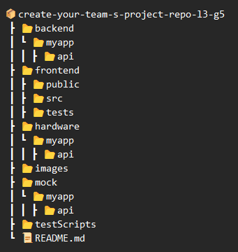

SYSC 3010 Project - Team Pi-na Colada <a name="TOP"></a>
===================

## Students
- Stefan Lukic 
- Filip Lukic 
- Pranav K Hari 


 
## Cocktail Maestro


### Project Summary 
To give users with a greater sense of control and customizability with their product, the Cocktail Maestro aims to provide users with the upmost freedom and modularity in creating custom beverages. The Cocktail Maestro aims to free users from manufacturer specific capsules and single purpose cocktail machines. By providing a more economical and customizable system, the Cocktail Maestro aims to democratize the cocktail mixing and drinking experience and give users the freedom to create, save, and experiment any combination of beverages. 


### Description
This repository contains code used to develop the Cocktail Maestro system. 


### Directory Structure 
The repository contains five top-level directories: Frontend, Backend, Hardware, Mock and Tests. A source code folder is commonly found in each of these directories. The frontend folder contains code for the GUI and frontend API calls. The backend folder contains code for flask routers and calls to the firebase database. The hardware folder contains code for the functionality of the sensors and raspberry pi in the system. The mock folder contains code that emulates the hardware part of the system. The testScripts folder contains tests for all the functionality in the system. 





</br>

# Installation 

### Prerequisites
Python 3.9+, NodeJs


### Clone the repo and navigate into the folder
```
git clone git@github.com:SYSC3010-W23/create-your-team-s-project-repo-l3-g5.git
```

```
cd create-your-team-s-project-repo-l3-g5
```

</br>

## Backend Server

### Navigate into the backend folder
```
cd backend/myapp
 ```

### Setup venv and install required packages
```
python3 -m venv . 
source bin/activate
python3 -m pip install -v flask flask-cors pyrebase python-dotenv
```

### Running
```
flask run
```

## Frontend Server

### Navigate into the frontend folder
```
cd frontend
```

### Setup Dependencies

```
npm ci
```

### Running

### Starting the Development Server

```
npm run dev
```

### Running on local network

```
npm run dev --host
```

## Hardware Server

### Navigate into the hardware folder
```
cd hardware/myapp 
```

### Setup venv and install required packages
```
python3 -m venv .
source bin/activate
python3 -m pip install -v flask sense-hat gpiozero
```

### Running
```
flask run
```

</br>


# Verify Installation 

### Install pytest
```
python3 -m pip install pytest
```

### Run hardware tests
``` 
cd testScripts/automation/hardware 
python3 -m pytest
```


### Run backend tests
``` 
cd testScripts/automation
python3 -m pytest
```


### Run frontend tests
``` 
cd frontend/tests
npm run test
```